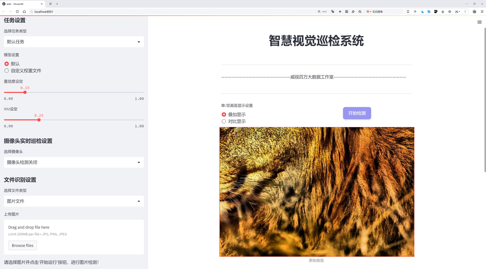
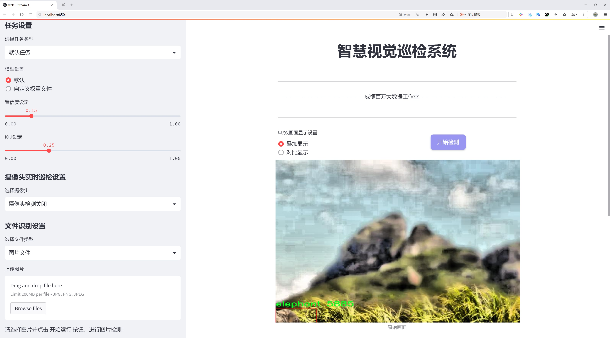
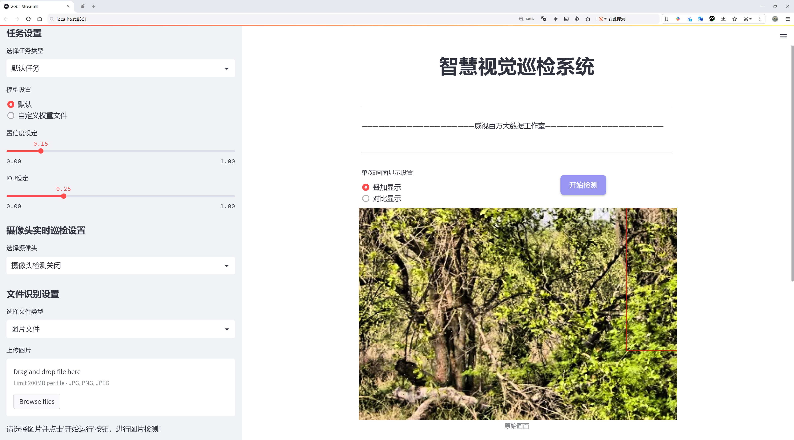
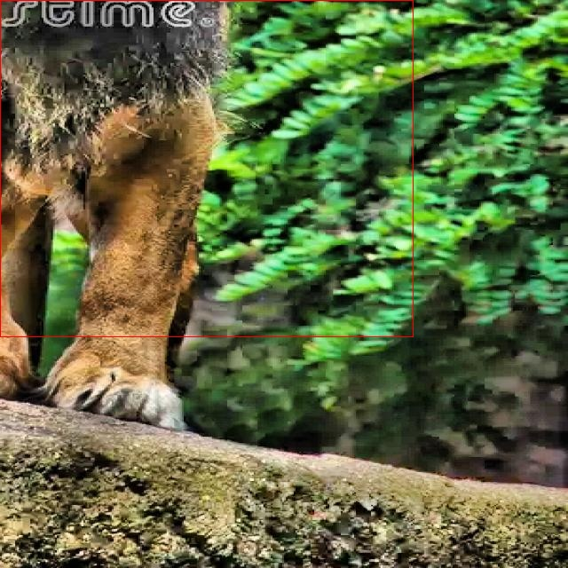
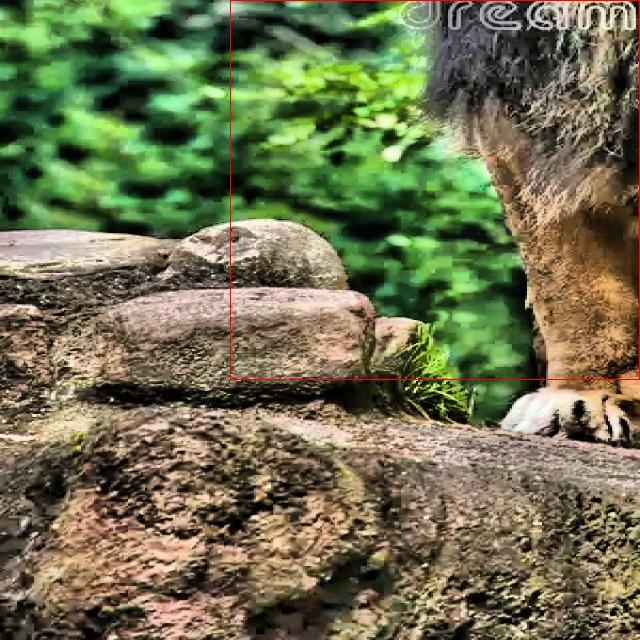
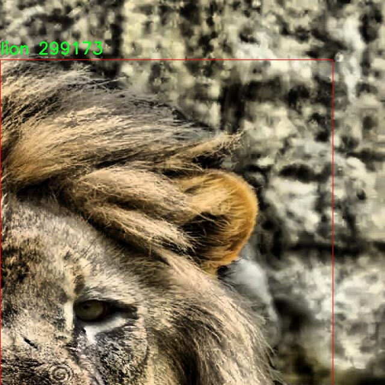
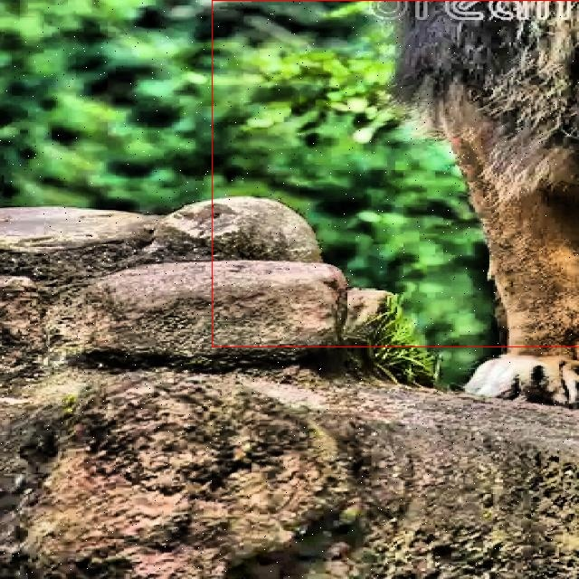
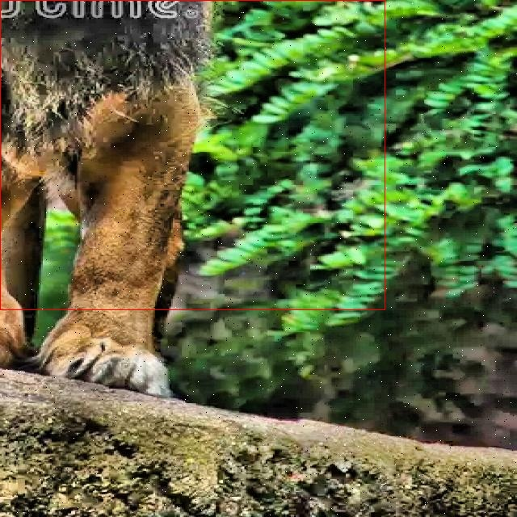

# 野生动物检测检测系统源码分享
 # [一条龙教学YOLOV8标注好的数据集一键训练_70+全套改进创新点发刊_Web前端展示]

### 1.研究背景与意义

项目参考[AAAI Association for the Advancement of Artificial Intelligence](https://gitee.com/qunshansj/projects)

项目来源[AACV Association for the Advancement of Computer Vision](https://gitee.com/qunmasj/projects)

研究背景与意义

随着全球生态环境的变化和人类活动的加剧，野生动物的栖息地正面临着前所未有的威胁。保护野生动物及其栖息地不仅是生物多样性保护的重要组成部分，也是维护生态平衡、促进可持续发展的关键因素。为了有效监测和保护野生动物，科学家们亟需开发高效、准确的动物检测系统。近年来，深度学习技术的迅猛发展为计算机视觉领域带来了革命性的变化，尤其是在目标检测任务中，基于卷积神经网络（CNN）的模型表现出了卓越的性能。YOLO（You Only Look Once）系列模型因其高效性和实时性，成为了目标检测领域的研究热点。

YOLOv8作为YOLO系列的最新版本，进一步提升了检测精度和速度，尤其在复杂环境下的表现更为出色。然而，尽管YOLOv8在多种场景下均取得了良好的效果，但在特定领域如野生动物检测中，仍然存在一些挑战。例如，野生动物的外观变化、背景复杂性以及光照条件的多样性，都会对检测模型的性能产生影响。因此，基于改进YOLOv8的野生动物检测系统的研究显得尤为重要。

本研究所使用的数据集包含1800张图像，涵盖了四种主要的野生动物类别：大象、河马、豹子和狮子。这些动物在生态系统中扮演着重要角色，保护它们不仅有助于维持生态平衡，也对旅游业和地方经济发展具有积极影响。通过对这些动物的有效监测，能够为生态保护提供数据支持，进而推动相关政策的制定和实施。

在此背景下，基于改进YOLOv8的野生动物检测系统的研究具有重要的学术和实践意义。首先，从学术角度来看，该研究将为目标检测领域提供新的思路和方法，通过对YOLOv8模型的改进，探索其在特定应用场景下的适应性和有效性。这不仅有助于丰富深度学习在生态保护中的应用案例，也为后续相关研究提供了理论基础和技术支持。

其次，从实践角度来看，构建一个高效的野生动物检测系统将极大地提升监测工作的效率和准确性。通过实时监测野生动物的活动情况，研究人员和保护组织能够及时获取重要信息，从而制定相应的保护措施，减少人类活动对野生动物的干扰。此外，该系统还可以为野生动物的行为研究提供数据支持，促进生态学、动物学等相关学科的发展。

综上所述，基于改进YOLOv8的野生动物检测系统的研究不仅具有重要的学术价值，也为实际生态保护工作提供了有力的技术支持。通过该研究，我们期望能够为全球野生动物保护事业贡献一份力量，推动人类与自然的和谐共生。

### 2.图片演示







##### 注意：由于此博客编辑较早，上面“2.图片演示”和“3.视频演示”展示的系统图片或者视频可能为老版本，新版本在老版本的基础上升级如下：（实际效果以升级的新版本为准）

  （1）适配了YOLOV8的“目标检测”模型和“实例分割”模型，通过加载相应的权重（.pt）文件即可自适应加载模型。

  （2）支持“图片识别”、“视频识别”、“摄像头实时识别”三种识别模式。

  （3）支持“图片识别”、“视频识别”、“摄像头实时识别”三种识别结果保存导出，解决手动导出（容易卡顿出现爆内存）存在的问题，识别完自动保存结果并导出到tempDir中。

  （4）支持Web前端系统中的标题、背景图等自定义修改，后面提供修改教程。

  另外本项目提供训练的数据集和训练教程,暂不提供权重文件（best.pt）,需要您按照教程进行训练后实现图片演示和Web前端界面演示的效果。

### 3.视频演示

[3.1 视频演示](https://www.bilibili.com/video/BV1SB4heaERM/)

### 4.数据集信息展示

##### 4.1 本项目数据集详细数据（类别数＆类别名）

nc: 4
names: ['elephant', 'hippo', 'leopard', 'lion']


##### 4.2 本项目数据集信息介绍

数据集信息展示

在本研究中，我们使用了名为“Animal detection”的数据集，以改进YOLOv8在野生动物检测系统中的性能。该数据集专注于四种特定的野生动物，涵盖了丰富的图像样本和多样的场景，以确保模型能够在各种环境中准确识别目标。这四种动物分别是大象、河马、豹子和狮子，每一种动物的图像都经过精心挑选和标注，以便为模型提供高质量的训练数据。

大象作为数据集中的一种重要类别，其图像展示了这一庞然大物在不同栖息地中的多样性。无论是在广袤的草原上，还是在茂密的森林中，大象的形态特征都能被清晰地捕捉到。通过提供不同角度、不同光照条件下的大象图像，数据集为模型的训练提供了丰富的视觉信息，使其能够更好地理解和识别这一物种的独特特征。

河马则是另一种具有挑战性的动物，其在水中和陆地上的行为差异使得检测任务更加复杂。数据集中包含了河马在水中嬉戏、在岸边休息等多种情境的图像。这些图像不仅展示了河马的体型和外观特征，还提供了背景环境的多样性，有助于模型学习如何在不同的环境中准确识别河马。

豹子作为一种隐秘而敏捷的捕食者，其在树上、草丛中和开阔地带的活动场景也被广泛覆盖。数据集中包含了豹子在不同环境中的多种姿态，帮助模型学习如何在复杂的背景中分辨出这一物种。豹子的斑点图案和体型特征为模型的识别能力提出了更高的要求，因此，这些图像的多样性对提升模型的鲁棒性至关重要。

最后，狮子作为“草原之王”，其图像同样在数据集中占据重要地位。狮子在群体中的行为、狩猎时的姿态以及在日常生活中的互动，都被详细记录。通过这些多样化的图像，模型不仅能够学习到狮子的外观特征，还能理解其社会行为和生态习性。这为模型提供了更为全面的知识基础，使其在实际应用中能够更好地应对复杂的检测任务。

综上所述，“Animal detection”数据集通过对大象、河马、豹子和狮子的多样化图像进行全面覆盖，为改进YOLOv8的野生动物检测系统提供了坚实的基础。数据集的丰富性和多样性不仅有助于提升模型的检测精度，也为未来的研究提供了广阔的探索空间。通过深入分析和训练，我们期望能够开发出更为高效和准确的野生动物检测系统，为保护和研究野生动物做出贡献。











### 5.全套项目环境部署视频教程（零基础手把手教学）

[5.1 环境部署教程链接（零基础手把手教学）](https://www.ixigua.com/7404473917358506534?logTag=c807d0cbc21c0ef59de5)


[5.2 安装Python虚拟环境创建和依赖库安装视频教程链接（零基础手把手教学）](https://www.ixigua.com/7404474678003106304?logTag=1f1041108cd1f708b01a)

### 6.手把手YOLOV8训练视频教程（零基础小白有手就能学会）

[6.1 手把手YOLOV8训练视频教程（零基础小白有手就能学会）](https://www.ixigua.com/7404477157818401292?logTag=d31a2dfd1983c9668658)

### 7.70+种全套YOLOV8创新点代码加载调参视频教程（一键加载写好的改进模型的配置文件）

[7.1 70+种全套YOLOV8创新点代码加载调参视频教程（一键加载写好的改进模型的配置文件）](https://www.ixigua.com/7404478314661806627?logTag=29066f8288e3f4eea3a4)

### 8.70+种全套YOLOV8创新点原理讲解（非科班也可以轻松写刊发刊，V10版本正在科研待更新）

由于篇幅限制，每个创新点的具体原理讲解就不一一展开，具体见下列网址中的创新点对应子项目的技术原理博客网址【Blog】：


[8.1 70+种全套YOLOV8创新点原理讲解链接](https://gitee.com/qunmasj/good)

### 9.系统功能展示（检测对象为举例，实际内容以本项目数据集为准）

图9.1.系统支持检测结果表格显示

  图9.2.系统支持置信度和IOU阈值手动调节

  图9.3.系统支持自定义加载权重文件best.pt(需要你通过步骤5中训练获得)

  图9.4.系统支持摄像头实时识别

  图9.5.系统支持图片识别

  图9.6.系统支持视频识别

  图9.7.系统支持识别结果文件自动保存

  图9.8.系统支持Excel导出检测结果数据


### 10.原始YOLOV8算法原理

原始YOLOv8算法原理

YOLOv8算法是目标检测领域中的一项重要进展，由Glenn-Jocher提出，延续了YOLO系列的优良传统，尤其是YOLOv3和YOLOv5的核心思想。在设计上，YOLOv8通过一系列的创新和改进，旨在提升目标检测的精度和速度，使其在实际应用中更加高效和灵活。

首先，YOLOv8在数据预处理方面继承了YOLOv5的策略，采用了多种数据增强技术，以提高模型的泛化能力。具体而言，YOLOv8引入了马赛克增强、混合增强、空间扰动和颜色扰动等四种增强手段。这些技术通过在训练过程中随机组合和变换图像，使得模型能够学习到更多的特征，从而在面对复杂场景时表现得更加稳健。马赛克增强尤其有效，它将多张图像拼接成一张新的训练样本，迫使模型适应不同的物体位置和背景变化，显著提升了模型的预测精度。

在骨干网络结构方面，YOLOv8的设计也体现了对YOLOv5的延续与创新。YOLOv5的主干网络通过逐层降采样特征图并引入C3模块来强化特征提取，而YOLOv8则将C3模块替换为新的C2f模块。C2f模块的设计灵感来源于YOLOv7的ELAN结构，增加了更多的分支以丰富梯度回传时的支流。这种结构不仅提升了特征表示能力，还增强了模型的学习能力，使得YOLOv8在特征提取方面表现得更加出色。

YOLOv8在特征金字塔网络（FPN）和路径聚合网络（PAN）的结合上也进行了优化。FPN-PAN结构能够有效地融合多尺度信息，使得模型在处理不同尺寸的目标时更加灵活。YOLOv8对FPN-PAN中的C3模块进行了替换，采用了C2f模块，进一步提升了特征融合的效果。这种设计使得YOLOv8在面对复杂场景时，能够更好地捕捉到目标的多样性和复杂性。

检测头的结构是YOLOv8的一大亮点。与YOLOv3和YOLOv5的耦合头不同，YOLOv8采用了解耦头的设计，将分类和定位任务分开处理。具体而言，YOLOv8的检测头由两条并行的分支组成，分别用于提取类别特征和位置特征。这样的设计使得模型在进行分类和定位时能够更专注于各自的任务，从而提高了整体的检测性能。此外，YOLOv8还引入了无锚框（Anchor-Free）检测头，进一步简化了模型结构，减少了锚框预测的数量，提升了检测速度。

在标签分配策略方面，YOLOv8摒弃了YOLOv5中依赖于数据集的自动聚类候选框策略，转而采用了TOOD策略。这种动态标签分配策略能够更有效地进行正负样本匹配，提升了模型在多尺度分配上的表现。YOLOv8的损失函数设计也相应进行了优化，分类损失采用了Varifocal Loss，回归损失则结合了CIoULoss与DFLLoss。这种损失函数的设计，使得模型在训练过程中能够更好地聚焦于高质量的正样本，从而提升了检测精度。

YOLOv8的整体网络结构分为输入端、骨干网络、颈部网络和头部网络四个部分。输入端采用自适应图像缩放技术，以提高目标检测和推理的速度。在骨干网络中，C2f模块的引入使得特征提取更加高效，而颈部网络则通过直接连接不同阶段的特征输出，增强了对不同尺度对象的特征融合能力。头部网络的解耦设计使得分类和检测过程更加独立，进一步提升了模型的性能。

总的来说，YOLOv8通过一系列的创新和改进，在目标检测的精度和速度上都取得了显著的提升。其在数据预处理、骨干网络、特征融合、检测头和标签分配策略等多个方面的优化，使得YOLOv8在复杂场景下表现得更加出色，成为目标检测领域中的一项重要工具。随着YOLOv8的广泛应用，未来在各类视觉任务中，它无疑将发挥更大的作用。


### 11.项目核心源码讲解（再也不用担心看不懂代码逻辑）

#### 11.1 code\ultralytics\utils\callbacks\raytune.py

以下是代码的核心部分，并附上详细的中文注释：

```python
# 导入Ultralytics YOLO库，遵循AGPL-3.0许可证
from ultralytics.utils import SETTINGS

# 尝试导入Ray库，并验证Ray Tune集成是否启用
try:
    assert SETTINGS["raytune"] is True  # 验证Ray Tune集成是否启用
    import ray
    from ray import tune
    from ray.air import session  # 导入Ray Air会话模块

except (ImportError, AssertionError):
    tune = None  # 如果导入失败或集成未启用，则将tune设置为None


def on_fit_epoch_end(trainer):
    """在每个训练周期结束时，将训练指标发送到Ray Tune。"""
    if ray.tune.is_session_enabled():  # 检查Ray Tune会话是否启用
        metrics = trainer.metrics  # 获取当前训练指标
        metrics["epoch"] = trainer.epoch  # 将当前周期数添加到指标中
        session.report(metrics)  # 向Ray Tune报告指标


# 定义回调函数，如果tune可用，则包含on_fit_epoch_end回调
callbacks = (
    {
        "on_fit_epoch_end": on_fit_epoch_end,  # 训练周期结束时的回调
    }
    if tune  # 如果tune可用
    else {}  # 否则为空字典
)
```

### 代码分析
1. **导入模块**：首先导入了`SETTINGS`，用于检查Ray Tune的集成状态。
2. **异常处理**：通过`try-except`结构，确保在未能导入Ray库或未启用Ray Tune集成时不会导致程序崩溃。
3. **`on_fit_epoch_end`函数**：这是一个回调函数，在每个训练周期结束时被调用，用于将训练的指标发送到Ray Tune，以便进行监控和调优。
4. **回调定义**：根据`tune`是否可用，定义一个包含回调函数的字典，以便在训练过程中使用。

### 关键点
- 代码的核心在于如何在训练过程中与Ray Tune进行集成，以便实时监控和优化模型训练的过程。

这个文件是一个用于Ultralytics YOLO项目的回调模块，主要功能是将训练过程中的指标（metrics）发送到Ray Tune，这是一个用于超参数调优的库。文件的开头包含了版权信息和许可证类型，接着导入了必要的模块。

首先，代码通过从`ultralytics.utils`导入`SETTINGS`来检查Ray Tune的集成是否被启用。具体来说，它会验证`SETTINGS`字典中的`raytune`键是否为`True`。如果集成被启用，代码会尝试导入Ray库及其相关模块`ray`、`tune`和`session`。如果导入失败或者集成未启用，`tune`将被设置为`None`，这意味着后续的回调功能将不可用。

接下来，定义了一个名为`on_fit_epoch_end`的函数，该函数会在每个训练周期结束时被调用。函数的主要功能是检查Ray Tune的会话是否已启用，如果启用，则从训练器（trainer）中获取当前的训练指标，并将当前的周期数（epoch）添加到这些指标中。然后，使用`session.report(metrics)`将这些指标报告给Ray Tune，以便进行后续的分析和调优。

最后，代码定义了一个名为`callbacks`的元组，如果`tune`不为`None`（即Ray Tune可用），则包含`on_fit_epoch_end`回调函数；否则，`callbacks`将是一个空字典。这种设计使得在不同的环境中可以灵活地使用或忽略Ray Tune的功能。

总的来说，这个文件的目的是为YOLO模型的训练过程提供与Ray Tune的集成支持，以便在训练期间实时监控和调整超参数。

#### 11.2 70+种YOLOv8算法改进源码大全和调试加载训练教程（非必要）\ultralytics\nn\extra_modules\afpn.py

以下是代码中最核心的部分，并附上详细的中文注释：

```python
import torch
import torch.nn as nn
import torch.nn.functional as F
from ..modules.conv import Conv

class BasicBlock(nn.Module):
    """基本的卷积块，包含两个卷积层和残差连接"""
    expansion = 1

    def __init__(self, filter_in, filter_out):
        super(BasicBlock, self).__init__()
        # 第一个卷积层，使用3x3卷积
        self.conv1 = Conv(filter_in, filter_out, 3)
        # 第二个卷积层，使用3x3卷积，不使用激活函数
        self.conv2 = Conv(filter_out, filter_out, 3, act=False)

    def forward(self, x):
        residual = x  # 保存输入，用于残差连接

        out = self.conv1(x)  # 通过第一个卷积层
        out = self.conv2(out)  # 通过第二个卷积层

        out += residual  # 添加残差
        return self.conv1.act(out)  # 返回经过激活函数处理的输出


class Upsample(nn.Module):
    """上采样模块，使用1x1卷积和双线性插值"""
    def __init__(self, in_channels, out_channels, scale_factor=2):
        super(Upsample, self).__init__()
        self.upsample = nn.Sequential(
            Conv(in_channels, out_channels, 1),  # 1x1卷积
            nn.Upsample(scale_factor=scale_factor, mode='bilinear')  # 双线性插值上采样
        )

    def forward(self, x):
        return self.upsample(x)  # 返回上采样后的结果


class Downsample_x2(nn.Module):
    """下采样模块，使用2x2卷积"""
    def __init__(self, in_channels, out_channels):
        super(Downsample_x2, self).__init__()
        self.downsample = Conv(in_channels, out_channels, 2, 2, 0)  # 2x2卷积，步幅为2

    def forward(self, x):
        return self.downsample(x)  # 返回下采样后的结果


class ASFF_2(nn.Module):
    """自适应特征融合模块，融合两个输入特征图"""
    def __init__(self, inter_dim=512):
        super(ASFF_2, self).__init__()
        self.inter_dim = inter_dim
        compress_c = 8  # 压缩通道数

        # 用于计算权重的卷积层
        self.weight_level_1 = Conv(self.inter_dim, compress_c, 1)
        self.weight_level_2 = Conv(self.inter_dim, compress_c, 1)
        self.weight_levels = nn.Conv2d(compress_c * 2, 2, kernel_size=1, stride=1, padding=0)
        self.conv = Conv(self.inter_dim, self.inter_dim, 3)  # 最后的卷积层

    def forward(self, input1, input2):
        # 计算每个输入的权重
        level_1_weight_v = self.weight_level_1(input1)
        level_2_weight_v = self.weight_level_2(input2)

        # 合并权重并计算最终权重
        levels_weight_v = torch.cat((level_1_weight_v, level_2_weight_v), 1)
        levels_weight = self.weight_levels(levels_weight_v)
        levels_weight = F.softmax(levels_weight, dim=1)  # 归一化权重

        # 融合输入特征图
        fused_out_reduced = input1 * levels_weight[:, 0:1, :, :] + \
                            input2 * levels_weight[:, 1:2, :, :]

        out = self.conv(fused_out_reduced)  # 通过卷积层
        return out  # 返回融合后的输出


class BlockBody_P345(nn.Module):
    """处理三个尺度特征图的模块"""
    def __init__(self, channels=[64, 128, 256, 512]):
        super(BlockBody_P345, self).__init__()

        # 初始化不同尺度的卷积块
        self.blocks_scalezero1 = nn.Sequential(Conv(channels[0], channels[0], 1))
        self.blocks_scaleone1 = nn.Sequential(Conv(channels[1], channels[1], 1))
        self.blocks_scaletwo1 = nn.Sequential(Conv(channels[2], channels[2], 1))

        # 下采样和上采样模块
        self.downsample_scalezero1_2 = Downsample_x2(channels[0], channels[1])
        self.upsample_scaleone1_2 = Upsample(channels[1], channels[0], scale_factor=2)

        # 自适应特征融合模块
        self.asff_scalezero1 = ASFF_2(inter_dim=channels[0])
        self.asff_scaleone1 = ASFF_2(inter_dim=channels[1])

        # 定义多个卷积块
        self.blocks_scalezero2 = nn.Sequential(
            BasicBlock(channels[0], channels[0]),
            BasicBlock(channels[0], channels[0]),
            BasicBlock(channels[0], channels[0]),
            BasicBlock(channels[0], channels[0]),
        )
        self.blocks_scaleone2 = nn.Sequential(
            BasicBlock(channels[1], channels[1]),
            BasicBlock(channels[1], channels[1]),
            BasicBlock(channels[1], channels[1]),
            BasicBlock(channels[1], channels[1]),
        )

    def forward(self, x):
        x0, x1, x2 = x  # 输入特征图

        # 通过卷积块处理输入
        x0 = self.blocks_scalezero1(x0)
        x1 = self.blocks_scaleone1(x1)
        x2 = self.blocks_scaletwo1(x2)

        # 进行特征融合
        scalezero = self.asff_scalezero1(x0, self.upsample_scaleone1_2(x1))
        scaleone = self.asff_scaleone1(self.downsample_scalezero1_2(x0), x1)

        # 继续处理融合后的特征图
        x0 = self.blocks_scalezero2(scalezero)
        x1 = self.blocks_scaleone2(scaleone)

        return x0, x1, x2  # 返回处理后的特征图
```

### 代码核心部分解释：
1. **BasicBlock**：定义了一个基本的卷积块，包含两个卷积层和残差连接，常用于构建深度神经网络。
2. **Upsample 和 Downsample**：实现了上采样和下采样的功能，分别用于特征图的尺寸调整。
3. **ASFF_2**：自适应特征融合模块，能够融合两个输入特征图，动态计算权重。
4. **BlockBody_P345**：处理三个尺度特征图的模块，使用卷积块和自适应特征融合模块，形成一个完整的特征处理流程。

这些部分是构建更复杂的网络结构（如AFPN等）的基础，负责特征提取和融合。

该程序文件实现了一个改进的特征金字塔网络（AFPN），用于目标检测任务，特别是与YOLOv8算法相关的应用。文件中定义了多个类，每个类代表网络中的不同模块和结构。

首先，`BasicBlock`类是一个基本的卷积块，包含两个卷积层和残差连接。这个结构可以帮助网络学习更深层次的特征，同时避免梯度消失的问题。

接下来，`Upsample`和`Downsample_x2`、`Downsample_x4`、`Downsample_x8`类用于实现特征图的上采样和下采样操作。这些操作在特征金字塔网络中非常重要，因为它们允许网络在不同的尺度上处理特征。

`ASFF_2`、`ASFF_3`和`ASFF_4`类实现了自适应特征融合模块（ASFF），用于在不同层之间融合特征。这些模块通过计算不同输入特征图的权重，动态地融合特征，从而提高网络的表达能力。

`BlockBody_P345`和`BlockBody_P2345`类是网络的主体部分，包含多个卷积块和自适应特征融合模块。它们负责处理输入特征图，并通过不同的上采样和下采样操作来生成多尺度的特征表示。

`AFPN_P345`和`AFPN_P2345`类是特征金字塔网络的主要结构，负责接收输入特征图并通过卷积和主体模块进行处理。它们还包括权重初始化的逻辑，以确保网络在训练开始时具有良好的性能。

最后，`BlockBody_P345_Custom`和`AFPN_P345_Custom`等类允许用户自定义块类型，以便在特定任务中使用不同的卷积块。这种灵活性使得网络可以根据具体需求进行调整和优化。

总体而言，该文件实现了一个复杂的特征金字塔网络结构，结合了多个模块以提高目标检测的性能，并提供了自定义的能力以适应不同的应用场景。

#### 11.3 ui.py

```python
import sys
import subprocess

def run_script(script_path):
    """
    使用当前 Python 环境运行指定的脚本。

    Args:
        script_path (str): 要运行的脚本路径

    Returns:
        None
    """
    # 获取当前 Python 解释器的路径
    python_path = sys.executable

    # 构建运行命令，使用 streamlit 运行指定的脚本
    command = f'"{python_path}" -m streamlit run "{script_path}"'

    # 执行命令
    result = subprocess.run(command, shell=True)
    # 检查命令执行结果，如果返回码不为0，则表示出错
    if result.returncode != 0:
        print("脚本运行出错。")


# 实例化并运行应用
if __name__ == "__main__":
    # 指定要运行的脚本路径
    script_path = "web.py"  # 这里可以替换为实际的脚本路径

    # 调用函数运行脚本
    run_script(script_path)
```

### 代码注释说明：
1. **导入模块**：
   - `sys`：用于获取当前 Python 解释器的路径。
   - `subprocess`：用于执行外部命令。

2. **定义 `run_script` 函数**：
   - 该函数接收一个参数 `script_path`，表示要运行的 Python 脚本的路径。
   - 函数内部首先获取当前 Python 解释器的路径，并构建一个命令字符串，该命令用于通过 `streamlit` 运行指定的脚本。

3. **执行命令**：
   - 使用 `subprocess.run` 执行构建的命令，并通过 `shell=True` 允许使用 shell 特性。
   - 检查命令的返回码，如果返回码不为0，表示脚本运行出错，打印错误信息。

4. **主程序入口**：
   - 使用 `if __name__ == "__main__":` 确保只有在直接运行该脚本时才会执行以下代码。
   - 指定要运行的脚本路径，并调用 `run_script` 函数来执行该脚本。

这个程序文件名为 `ui.py`，其主要功能是通过当前的 Python 环境运行一个指定的脚本，具体来说是一个名为 `web.py` 的脚本。程序的开头部分导入了必要的模块，包括 `sys`、`os` 和 `subprocess`，这些模块分别用于系统相关的操作、文件路径处理和执行外部命令。

在文件中定义了一个名为 `run_script` 的函数，该函数接受一个参数 `script_path`，表示要运行的脚本的路径。函数内部首先获取当前 Python 解释器的路径，这通过 `sys.executable` 实现。接着，构建一个命令字符串，该命令使用当前的 Python 解释器和 `streamlit` 模块来运行指定的脚本。`streamlit` 是一个用于构建数据应用的库。

然后，使用 `subprocess.run` 方法执行构建好的命令。这个方法会在一个新的 shell 中运行命令，并等待其完成。如果命令执行的返回码不为 0，表示脚本运行出错，程序会打印出错误信息。

在文件的最后部分，使用 `if __name__ == "__main__":` 语句来确保只有在直接运行该文件时才会执行后面的代码。这里指定了要运行的脚本路径为 `web.py`，并调用 `run_script` 函数来执行该脚本。

整体来看，这个程序的主要作用是封装了一个运行特定 Python 脚本的功能，便于在当前环境中快速启动和调试 `web.py` 脚本。

#### 11.4 70+种YOLOv8算法改进源码大全和调试加载训练教程（非必要）\ultralytics\models\yolo\classify\predict.py

以下是经过简化和注释的核心代码部分：

```python
import torch
from ultralytics.engine.predictor import BasePredictor
from ultralytics.engine.results import Results
from ultralytics.utils import DEFAULT_CFG, ops

class ClassificationPredictor(BasePredictor):
    """
    该类扩展了 BasePredictor 类，用于基于分类模型进行预测。
    """

    def __init__(self, cfg=DEFAULT_CFG, overrides=None, _callbacks=None):
        """初始化 ClassificationPredictor，将任务设置为 'classify'。"""
        super().__init__(cfg, overrides, _callbacks)  # 调用父类构造函数
        self.args.task = 'classify'  # 设置任务类型为分类

    def preprocess(self, img):
        """将输入图像转换为模型兼容的数据类型。"""
        # 如果输入不是 torch.Tensor 类型，则将其转换为 Tensor
        if not isinstance(img, torch.Tensor):
            img = torch.stack([self.transforms(im) for im in img], dim=0)  # 应用转换并堆叠
        # 将图像移动到模型所在的设备上
        img = (img if isinstance(img, torch.Tensor) else torch.from_numpy(img)).to(self.model.device)
        # 根据模型的精度设置将图像转换为半精度或单精度浮点数
        return img.half() if self.model.fp16 else img.float()  # uint8 转换为 fp16/32

    def postprocess(self, preds, img, orig_imgs):
        """对预测结果进行后处理，返回 Results 对象。"""
        # 如果原始图像不是列表，则将其转换为 numpy 数组
        if not isinstance(orig_imgs, list):
            orig_imgs = ops.convert_torch2numpy_batch(orig_imgs)

        results = []  # 存储结果的列表
        for i, pred in enumerate(preds):  # 遍历每个预测结果
            orig_img = orig_imgs[i]  # 获取对应的原始图像
            img_path = self.batch[0][i]  # 获取图像路径
            # 创建 Results 对象并添加到结果列表中
            results.append(Results(orig_img, path=img_path, names=self.model.names, probs=pred))
        return results  # 返回结果列表
```

### 代码注释说明：
1. **导入必要的库**：导入 PyTorch 和 Ultralytics 的相关模块。
2. **ClassificationPredictor 类**：该类用于处理分类任务，继承自 `BasePredictor`。
3. **初始化方法**：设置任务类型为分类，并调用父类的初始化方法。
4. **预处理方法**：将输入图像转换为适合模型的格式，包括类型转换和设备转移。
5. **后处理方法**：处理模型的预测结果，将其转换为可用的 `Results` 对象，并返回结果列表。

该程序文件是一个用于YOLOv8分类模型预测的Python脚本，主要实现了图像分类的功能。文件中首先导入了必要的库，包括PyTorch和Ultralytics库中的一些模块。

在文件中定义了一个名为`ClassificationPredictor`的类，它继承自`BasePredictor`类。这个类专门用于基于分类模型进行预测。类的文档注释中提到，可以将Torchvision的分类模型传递给`model`参数，例如使用`model='resnet18'`。文档中还提供了一个示例，展示了如何使用该类进行预测。

类的构造函数`__init__`初始化了`ClassificationPredictor`，并将任务类型设置为“分类”。在初始化过程中，它调用了父类的构造函数，并传递了配置参数、覆盖参数和回调函数。

`preprocess`方法用于对输入图像进行预处理，以便将其转换为模型兼容的数据类型。该方法首先检查输入是否为PyTorch张量，如果不是，则将输入图像堆叠成一个张量。接着，它将图像移动到模型所在的设备上，并根据模型的浮点精度（fp16或fp32）将图像转换为相应的数据类型。

`postprocess`方法则用于对模型的预测结果进行后处理，以返回`Results`对象。该方法首先检查原始图像是否为列表，如果不是，则将其转换为NumPy数组。然后，它遍历每个预测结果，将原始图像、图像路径、模型名称和预测概率封装到`Results`对象中，并将这些对象存储在结果列表中，最终返回该列表。

总体而言，该文件实现了YOLOv8分类模型的预测功能，包括输入图像的预处理和输出结果的后处理，便于用户进行图像分类任务。

#### 11.5 train.py

以下是经过简化和注释的核心代码部分，主要集中在YOLO模型的训练和数据处理上：

```python
import random
import numpy as np
import torch.nn as nn
from ultralytics.data import build_dataloader, build_yolo_dataset
from ultralytics.engine.trainer import BaseTrainer
from ultralytics.models import yolo
from ultralytics.nn.tasks import DetectionModel
from ultralytics.utils import LOGGER, RANK
from ultralytics.utils.torch_utils import de_parallel, torch_distributed_zero_first

class DetectionTrainer(BaseTrainer):
    """
    基于检测模型的训练类，继承自BaseTrainer类。
    """

    def build_dataset(self, img_path, mode="train", batch=None):
        """
        构建YOLO数据集。

        参数:
            img_path (str): 包含图像的文件夹路径。
            mode (str): 模式，可以是'train'或'val'，用户可以为每种模式自定义不同的增强。
            batch (int, optional): 批次大小，适用于'rect'模式。默认为None。
        """
        gs = max(int(de_parallel(self.model).stride.max() if self.model else 0), 32)  # 获取模型的最大步幅
        return build_yolo_dataset(self.args, img_path, batch, self.data, mode=mode, rect=mode == "val", stride=gs)

    def get_dataloader(self, dataset_path, batch_size=16, rank=0, mode="train"):
        """构建并返回数据加载器。"""
        assert mode in ["train", "val"]  # 确保模式有效
        with torch_distributed_zero_first(rank):  # 在分布式训练中，确保数据集只初始化一次
            dataset = self.build_dataset(dataset_path, mode, batch_size)
        shuffle = mode == "train"  # 训练模式下打乱数据
        workers = self.args.workers if mode == "train" else self.args.workers * 2  # 设置工作线程数
        return build_dataloader(dataset, batch_size, workers, shuffle, rank)  # 返回数据加载器

    def preprocess_batch(self, batch):
        """对图像批次进行预处理，包括缩放和转换为浮点数。"""
        batch["img"] = batch["img"].to(self.device, non_blocking=True).float() / 255  # 将图像转换为浮点数并归一化
        if self.args.multi_scale:  # 如果启用多尺度训练
            imgs = batch["img"]
            sz = (
                random.randrange(self.args.imgsz * 0.5, self.args.imgsz * 1.5 + self.stride)
                // self.stride
                * self.stride
            )  # 随机选择图像大小
            sf = sz / max(imgs.shape[2:])  # 计算缩放因子
            if sf != 1:
                ns = [
                    math.ceil(x * sf / self.stride) * self.stride for x in imgs.shape[2:]
                ]  # 计算新的图像形状
                imgs = nn.functional.interpolate(imgs, size=ns, mode="bilinear", align_corners=False)  # 调整图像大小
            batch["img"] = imgs  # 更新批次图像
        return batch

    def get_model(self, cfg=None, weights=None, verbose=True):
        """返回YOLO检测模型。"""
        model = DetectionModel(cfg, nc=self.data["nc"], verbose=verbose and RANK == -1)  # 创建检测模型
        if weights:
            model.load(weights)  # 加载预训练权重
        return model

    def plot_training_samples(self, batch, ni):
        """绘制带有注释的训练样本。"""
        plot_images(
            images=batch["img"],
            batch_idx=batch["batch_idx"],
            cls=batch["cls"].squeeze(-1),
            bboxes=batch["bboxes"],
            paths=batch["im_file"],
            fname=self.save_dir / f"train_batch{ni}.jpg",
            on_plot=self.on_plot,
        )
```

### 代码说明：
1. **类定义**：`DetectionTrainer` 继承自 `BaseTrainer`，用于处理YOLO模型的训练过程。
2. **数据集构建**：`build_dataset` 方法根据给定的图像路径和模式构建YOLO数据集，支持训练和验证模式。
3. **数据加载器**：`get_dataloader` 方法创建数据加载器，确保在分布式训练中只初始化一次数据集。
4. **批次预处理**：`preprocess_batch` 方法对图像批次进行归一化和缩放处理，以适应不同的输入大小。
5. **模型获取**：`get_model` 方法返回一个YOLO检测模型，并可选择加载预训练权重。
6. **绘制训练样本**：`plot_training_samples` 方法用于可视化训练样本及其注释，便于检查训练数据的质量。

这个程序文件 `train.py` 是一个用于训练 YOLO（You Only Look Once）目标检测模型的脚本，继承自 `BaseTrainer` 类。它包含了一系列方法，用于构建数据集、获取数据加载器、预处理图像、设置模型属性、获取模型、进行验证、记录损失、显示训练进度、绘制训练样本和绘制训练指标等。

在 `DetectionTrainer` 类中，`build_dataset` 方法用于构建 YOLO 数据集，接收图像路径、模式（训练或验证）和批次大小作为参数。它会根据模型的步幅计算合适的尺寸，并调用 `build_yolo_dataset` 函数来创建数据集。

`get_dataloader` 方法则用于构建数据加载器，确保在分布式训练时只初始化一次数据集，并根据模式决定是否打乱数据顺序。它还会根据训练或验证模式调整工作线程的数量。

`preprocess_batch` 方法负责对图像批次进行预处理，包括将图像缩放到适当的大小并转换为浮点数格式。若启用了多尺度训练，它会随机选择一个尺寸进行调整。

`set_model_attributes` 方法用于设置模型的属性，包括类别数量和类别名称等，确保模型能够正确识别训练数据中的目标。

`get_model` 方法返回一个 YOLO 检测模型实例，并在提供权重时加载这些权重。

`get_validator` 方法返回一个用于验证模型性能的验证器，记录损失名称并初始化验证器。

`label_loss_items` 方法用于返回一个包含标记训练损失项的字典，便于后续的损失分析。

`progress_string` 方法返回一个格式化的字符串，显示训练进度，包括当前的轮次、GPU 内存使用情况、损失值、实例数量和图像大小等信息。

`plot_training_samples` 方法用于绘制训练样本及其标注，方便可视化训练过程中的数据。

最后，`plot_metrics` 和 `plot_training_labels` 方法分别用于绘制训练过程中记录的指标和标签，帮助分析模型的训练效果。

整体来看，这个脚本提供了一个结构化的方式来训练 YOLO 模型，涵盖了从数据处理到模型训练和验证的各个方面。

#### 11.6 70+种YOLOv8算法改进源码大全和调试加载训练教程（非必要）\ultralytics\data\converter.py

以下是代码中最核心的部分，并附上详细的中文注释：

```python
def coco91_to_coco80_class():
    """
    将91个COCO类ID转换为80个COCO类ID。

    返回:
        (list): 一个包含91个类ID的列表，其中索引表示80个类ID，值为对应的91个类ID。
    """
    return [
        0, 1, 2, 3, 4, 5, 6, 7, 8, 9, 10, None, 11, 12, 13, 14, 15, 16, 17, 18, 19, 20, 21, 22, 23, None, 24, 25, None,
        None, 26, 27, 28, 29, 30, 31, 32, 33, 34, 35, 36, 37, 38, 39, None, 40, 41, 42, 43, 44, 45, 46, 47, 48, 49, 50,
        51, 52, 53, 54, 55, 56, 57, 58, 59, None, 60, None, None, 61, None, 62, 63, 64, 65, 66, 67, 68, 69, 70, 71, 72,
        None, 73, 74, 75, 76, 77, 78, 79, None]

def convert_coco(labels_dir='../coco/annotations/',
                 save_dir='coco_converted/',
                 use_segments=False,
                 use_keypoints=False,
                 cls91to80=True):
    """
    将COCO数据集的注释转换为适合训练YOLO模型的YOLO注释格式。

    参数:
        labels_dir (str, optional): 包含COCO数据集注释文件的目录路径。
        save_dir (str, optional): 保存结果的目录路径。
        use_segments (bool, optional): 是否在输出中包含分割掩码。
        use_keypoints (bool, optional): 是否在输出中包含关键点注释。
        cls91to80 (bool, optional): 是否将91个COCO类ID映射到对应的80个COCO类ID。

    输出:
        在指定的输出目录中生成输出文件。
    """

    # 创建数据集目录
    save_dir = increment_path(save_dir)  # 如果保存目录已存在，则增加后缀
    for p in save_dir / 'labels', save_dir / 'images':
        p.mkdir(parents=True, exist_ok=True)  # 创建目录

    # 转换类
    coco80 = coco91_to_coco80_class()  # 获取COCO 80类ID映射

    # 导入json文件
    for json_file in sorted(Path(labels_dir).resolve().glob('*.json')):
        fn = Path(save_dir) / 'labels' / json_file.stem.replace('instances_', '')  # 文件夹名称
        fn.mkdir(parents=True, exist_ok=True)
        with open(json_file) as f:
            data = json.load(f)  # 读取json数据

        # 创建图像字典
        images = {f'{x["id"]:d}': x for x in data['images']}
        # 创建图像-注释字典
        imgToAnns = defaultdict(list)
        for ann in data['annotations']:
            imgToAnns[ann['image_id']].append(ann)

        # 写入标签文件
        for img_id, anns in TQDM(imgToAnns.items(), desc=f'Annotations {json_file}'):
            img = images[f'{img_id:d}']
            h, w, f = img['height'], img['width'], img['file_name']

            bboxes = []  # 存储边界框
            segments = []  # 存储分割
            keypoints = []  # 存储关键点
            for ann in anns:
                if ann['iscrowd']:
                    continue  # 跳过人群注释
                # COCO框格式为 [左上角x, 左上角y, 宽度, 高度]
                box = np.array(ann['bbox'], dtype=np.float64)
                box[:2] += box[2:] / 2  # 将左上角坐标转换为中心坐标
                box[[0, 2]] /= w  # 归一化x坐标
                box[[1, 3]] /= h  # 归一化y坐标
                if box[2] <= 0 or box[3] <= 0:  # 如果宽度或高度小于等于0
                    continue

                cls = coco80[ann['category_id'] - 1] if cls91to80 else ann['category_id'] - 1  # 类别
                box = [cls] + box.tolist()  # 将类别和边界框合并
                if box not in bboxes:
                    bboxes.append(box)  # 添加边界框
                if use_segments and ann.get('segmentation') is not None:
                    # 处理分割信息
                    if len(ann['segmentation']) == 0:
                        segments.append([])
                        continue
                    elif len(ann['segmentation']) > 1:
                        s = merge_multi_segment(ann['segmentation'])  # 合并多个分割
                        s = (np.concatenate(s, axis=0) / np.array([w, h])).reshape(-1).tolist()
                    else:
                        s = [j for i in ann['segmentation'] for j in i]  # 合并所有分割
                        s = (np.array(s).reshape(-1, 2) / np.array([w, h])).reshape(-1).tolist()
                    s = [cls] + s
                    if s not in segments:
                        segments.append(s)  # 添加分割
                if use_keypoints and ann.get('keypoints') is not None:
                    keypoints.append(box + (np.array(ann['keypoints']).reshape(-1, 3) /
                                            np.array([w, h, 1])).reshape(-1).tolist())

            # 写入文件
            with open((fn / f).with_suffix('.txt'), 'a') as file:
                for i in range(len(bboxes)):
                    if use_keypoints:
                        line = *(keypoints[i]),  # 类别, 边界框, 关键点
                    else:
                        line = *(segments[i]
                                 if use_segments and len(segments[i]) > 0 else bboxes[i]),  # 类别, 边界框或分割
                    file.write(('%g ' * len(line)).rstrip() % line + '\n')  # 写入数据

    LOGGER.info(f'COCO数据成功转换。\n结果保存到 {save_dir.resolve()}')
```

### 代码核心部分说明：
1. **类ID转换函数**：`coco91_to_coco80_class`用于将91个COCO类ID转换为80个COCO类ID，以便于YOLO模型的训练。
2. **转换函数**：`convert_coco`函数是主要的转换逻辑，它读取COCO格式的注释文件，并将其转换为YOLO格式，支持边界框、分割和关键点的输出。
3. **文件处理**：函数中使用了`Path`和`json`模块来处理文件路径和读取JSON数据，使用`defaultdict`来存储图像与其注释的映射关系。
4. **数据归一化**：在处理边界框时，将其归一化为相对于图像宽高的比例，以便于YOLO模型的输入要求。
5. **写入文件**：最后将转换后的数据写入文本文件中，符合YOLO格式。

这个程序文件是用于将COCO数据集的标注格式转换为YOLO模型所需的标注格式的工具。它包含了几个主要的功能，包括将COCO数据集的91类标签转换为80类标签，以及将DOTA数据集的标注转换为YOLO的有向边界框（OBB）格式。

首先，文件中定义了两个函数`coco91_to_coco80_class`和`coco80_to_coco91_class`，它们分别用于在COCO数据集中将91个类别的ID转换为80个类别的ID，以及反向转换。这两个函数返回一个列表，其中每个索引对应于一个类别ID，值则是相应的类别ID。

接下来，`convert_coco`函数是主要的转换函数。它接受多个参数，包括COCO标注文件的目录、保存结果的目录、是否使用分割掩码和关键点等。该函数首先创建保存结果的目录，并调用`coco91_to_coco80_class`函数来获取类别映射。然后，它读取指定目录下的所有JSON文件，解析每个文件中的图像和标注信息，并将其转换为YOLO格式。YOLO格式的标注文件包含类别ID和归一化的边界框坐标。

在处理每个图像的标注时，程序会检查每个标注是否为“人群”标注，并跳过这些标注。对于每个有效的标注，程序会将边界框的坐标从COCO格式转换为YOLO格式，并将其写入到相应的文本文件中。如果启用了分割掩码或关键点，程序还会处理这些信息并将其写入输出文件。

此外，文件中还定义了`convert_dota_to_yolo_obb`函数，用于将DOTA数据集的标注转换为YOLO OBB格式。该函数读取DOTA数据集中的图像和原始标注，处理每个图像的标注并将其转换为YOLO格式，最后将结果保存到指定的目录中。

`min_index`函数用于查找两个二维点数组之间距离最短的点对的索引，而`merge_multi_segment`函数则用于合并多个分割线段，将它们连接成一个完整的线段。

总的来说，这个程序文件提供了一系列工具和函数，用于处理和转换图像数据集的标注格式，以便于在YOLO模型中进行训练和推理。通过这些功能，用户可以方便地将不同格式的数据集转换为YOLO所需的格式，从而加速模型的训练过程。

### 12.系统整体结构（节选）

### 整体功能和构架概括

该项目是一个基于YOLOv8的目标检测框架，包含了多个模块和工具，旨在提供高效的模型训练、推理和数据处理功能。整体架构包括以下几个关键部分：

1. **模型训练**：`train.py` 文件负责训练YOLO模型，包含数据集构建、模型初始化、训练过程管理和结果记录等功能。
2. **数据处理**：`converter.py` 文件用于将不同格式的数据集（如COCO和DOTA）转换为YOLO所需的标注格式，便于训练和推理。
3. **预测功能**：`predict.py` 文件实现了图像分类的预测功能，支持对输入图像进行预处理和后处理，返回分类结果。
4. **特征提取**：`afpn.py` 文件实现了自适应特征金字塔网络（AFPN），用于提高目标检测模型的特征提取能力。
5. **回调和超参数调优**：`raytune.py` 文件提供了与Ray Tune的集成支持，用于在训练过程中实时监控和调整超参数。
6. **用户界面**：`ui.py` 文件用于启动和运行特定的脚本，提供了一个简单的用户界面。
7. **工具和实用函数**：其他文件如`torch_utils.py`、`VanillaNet.py`、`model.py`、`validator.py`、`__init__.py`、`tal.py`和`val.py`等，提供了各种工具函数、模型定义和验证功能，支持整个框架的运行。

### 文件功能整理表

| 文件路径                                                                                          | 功能描述                                                                                       |
|---------------------------------------------------------------------------------------------------|-----------------------------------------------------------------------------------------------|
| `code\ultralytics\utils\callbacks\raytune.py`                                                    | 提供与Ray Tune的集成支持，用于训练过程中的超参数调优和指标监控。                               |
| `70+种YOLOv8算法改进源码大全和调试加载训练教程（非必要）\ultralytics\nn\extra_modules\afpn.py` | 实现自适应特征金字塔网络（AFPN），用于增强目标检测模型的特征提取能力。                       |
| `ui.py`                                                                                           | 启动和运行指定的Python脚本，提供简单的用户界面。                                             |
| `70+种YOLOv8算法改进源码大全和调试加载训练教程（非必要）\ultralytics\models\yolo\classify\predict.py` | 实现图像分类的预测功能，包括输入图像的预处理和输出结果的后处理。                             |
| `train.py`                                                                                        | 负责YOLO模型的训练，包括数据集构建、模型初始化、训练过程管理和结果记录。                     |
| `70+种YOLOv8算法改进源码大全和调试加载训练教程（非必要）\ultralytics\data\converter.py`       | 将COCO和DOTA数据集的标注格式转换为YOLO所需的格式，便于训练和推理。                           |
| `code\ultralytics\utils\torch_utils.py`                                                         | 提供与PyTorch相关的工具函数，支持模型训练和推理过程中的各种操作。                           |
| `70+种YOLOv8算法改进源码大全和调试加载训练教程（非必要）\ultralytics\nn\backbone\VanillaNet.py` | 定义基础的神经网络结构（VanillaNet），用于YOLO模型的特征提取。                               |
| `70+种YOLOv8算法改进源码大全和调试加载训练教程（非必要）\ultralytics\models\nas\model.py`     | 实现神经架构搜索（NAS）相关的模型定义和功能，支持模型的自动化设计。                           |
| `70+种YOLOv8算法改进源码大全和调试加载训练教程（非必要）\ultralytics\engine\validator.py`     | 提供模型验证功能，评估训练过程中模型的性能和准确性。                                         |
| `code\ultralytics\nn\__init__.py`                                                                | 初始化神经网络模块，导入必要的类和函数。                                                     |
| `code\ultralytics\utils\tal.py`                                                                  | 提供与训练和推理相关的辅助函数和工具。                                                       |
| `code\ultralytics\models\rtdetr\val.py`                                                         | 实现RT-DETR模型的验证功能，评估模型在特定数据集上的表现。                                   |

这个表格总结了每个文件的主要功能，展示了整个项目的结构和功能模块之间的关系。

注意：由于此博客编辑较早，上面“11.项目核心源码讲解（再也不用担心看不懂代码逻辑）”中部分代码可能会优化升级，仅供参考学习，完整“训练源码”、“Web前端界面”和“70+种创新点源码”以“13.完整训练+Web前端界面+70+种创新点源码、数据集获取”的内容为准。

### 13.完整训练+Web前端界面+70+种创新点源码、数据集获取


# [下载链接：https://mbd.pub/o/bread/ZpuTmJhp](https://mbd.pub/o/bread/ZpuTmJhp)